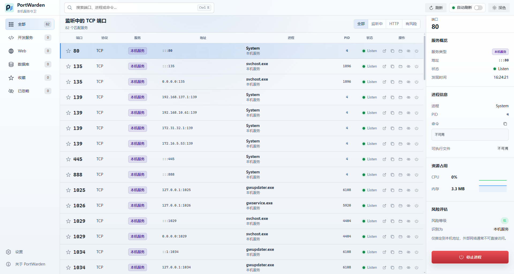
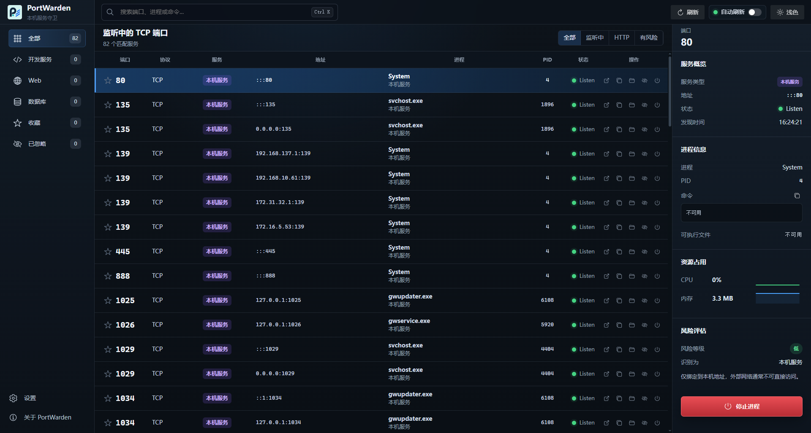

# PortWarden

English | [简体中文](README.zh-CN.md)


PortWarden is a Windows desktop app for developers to discover, inspect, and manage local TCP listening ports, related processes, and development services.

The current version focuses on local Windows development. It scans TCP Listening ports only and requires PowerShell 7 through `pwsh`.

## Preview

Light theme:



Dark theme:



## Features

- Inspect local listening ports, addresses, PIDs, process names, command lines, and executable paths.
- Detect common local services such as Vite, Next.js, Webpack, Node.js, FastAPI, Spring Boot, PostgreSQL, and Redis.
- Show risk levels based on bind addresses and service types.
- Search, filter, sort, favorite, ignore, and auto-refresh ports.
- Open local HTTP addresses, copy text, and reveal executable paths.
- Stop processes, with a second confirmation when force termination is required.
- Mask common sensitive fields in command lines by default.
- Support light, dark, and system color themes.

## Requirements

- Windows 10/11
- PowerShell 7.x, with `pwsh` available in `PATH`
- Node.js LTS
- pnpm 10

Check PowerShell:

```powershell
pwsh -NoLogo -NoProfile -Command "$PSVersionTable.PSVersion"
```

## Development

```bash
pnpm install
pnpm dev
```

Common commands:

| Command             | Purpose                            |
| ------------------- | ---------------------------------- |
| `pnpm dev`          | Start the development environment  |
| `pnpm check`        | Run format, lint, and type checks  |
| `pnpm format`       | Format code                        |
| `pnpm format:check` | Check formatting status            |
| `pnpm test`         | Run unit tests                     |
| `pnpm build`        | Build the app                      |
| `pnpm package:win`  | Build the Windows portable package |

## Packaging

```bash
pnpm package:win
```

Build artifacts are written to `release/`:

```text
release/PortWarden-<version>-portable.exe
```

For the current version:

```text
PortWarden-0.1.0-portable.exe
```

The portable package runs without installation, but the target machine still needs PowerShell 7.

## Project Structure

```text
src/
  main/       Electron main process, port scanning, process actions, preferences
  preload/    Allowlisted IPC API exposed to the renderer
  renderer/   Vue 3 desktop UI
  shared/     Shared types, sanitization logic, service detection rules
tests/        Unit tests
```

## Local Data

User preferences are saved to Electron's `userData/preferences.json`, including auto-refresh, refresh interval, language, and theme mode.

Favorites and ignored items are currently stored only in the current app session and are not persisted after restart.

## Limitations

- Windows only.
- Scans TCP Listening ports only.
- Does not scan UDP.
- Does not elevate privileges automatically, so some process details may be unavailable.
- Service detection and risk hints are heuristic and may produce false positives or false negatives.

## Changelog

See [CHANGELOG.md](CHANGELOG.md) for release notes.

## License

MIT
